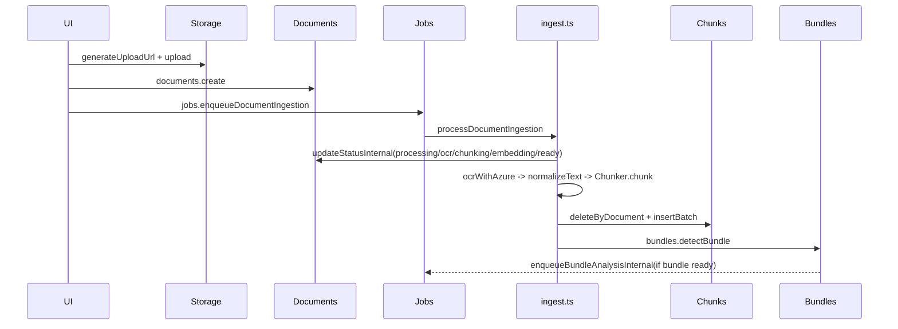
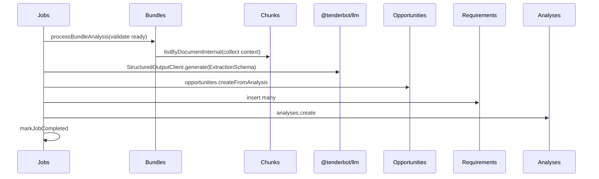
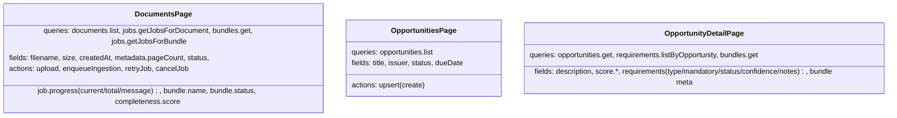

# TenderBot V2 — Data Models and ERDs

This single document consolidates the core data model across three layers:
- Database entities (Convex schema) and their relationships
- Service workflows (Convex functions/actions and background jobs)
- UI view‑model mapping (Next.js pages → data queries → fields)

Notes:
- Convex uses logical relations by ID (no enforced foreign keys). Access control is enforced in server resolvers using `createdBy` and `organizationId`.
- Timestamps are stored as numbers (epoch ms). Many tables include optional `organizationId` for org scoping.

## Database ERD

```mermaid
erDiagram
  USERS {
    string clerkId
    string email
    string name
    string imageUrl
    string organizationId
    string role
    number createdAt
    number updatedAt
  }

  DOCUMENTS {
    string _id
    string filename
    string mimeType
    number size
    string storageId
    string r2Key
    string status
    object checksums
    object metadata(pageCount, language, extractedAt, ocrMethod)
    string bundleId
    string createdBy
    string organizationId
    number createdAt
    number updatedAt
  }

  CHUNKS {
    string _id
    string documentId
    number sequence
    string text
    number tokens
    object metadata(page, section, heading, startOffset, endOffset)
    number[1536] embedding
    string organizationId
    number createdAt
  }

  BUNDLES {
    string _id
    string name
    string issuer
    string referenceNumber
    number dueDate
    string status
    object completeness(score)
    object metadata(totalPages, totalSize, detectedAt, confidence, bundleType)
    string createdBy
    string organizationId
    number createdAt
    number updatedAt
  }

  OPPORTUNITIES {
    string _id
    string title
    string issuer
    string issuerCategory
    string referenceNumber
    number dueDate
    number publishedDate
    number estimatedValue
    string currency
    string description
    string status
    string bundleId
    object risks[]
    object score(overall, eligibility, competitiveness, strategicFit)
    string createdBy
    string organizationId
    number createdAt
    number updatedAt
  }

  REQUIREMENTS {
    string _id
    string opportunityId
    string type
    string description
    boolean mandatory
    string status
    number confidence
    string notes
    number createdAt
    string organizationId
  }

  ANALYSES {
    string _id
    string type
    string targetId
    string summary
    object metadata(model, tokensUsed, cost, latencyMs, groundedness)
    string version
    string createdBy
    string organizationId
    number createdAt
  }

  JOBS {
    string _id
    string type
    any input
    any output
    string status
    object progress(current,total,message)
    object error(message,code,stack,retryable)
    number attempts
    number maxAttempts
    string resumeToken
    any resumeData
    string createdBy
    string organizationId
    number createdAt
    number startedAt
    number finishedAt
    number scheduledFor
  }

  NOTIFICATIONS {
    string _id
    string userId
    string type
    string title
    string message
    boolean read
    string actionUrl
    any metadata
    number createdAt
  }

  COMMENTS {
    string _id
    string targetType
    string targetId
    string authorId
    string content
    string[] mentions
    boolean resolved
    object metadata(page, selection)
    number createdAt
    number updatedAt
  }

  USERS ||--o{ DOCUMENTS : createdBy
  USERS ||--o{ BUNDLES : createdBy
  USERS ||--o{ OPPORTUNITIES : createdBy
  USERS ||--o{ JOBS : createdBy
  USERS ||--o{ NOTIFICATIONS : userId
  USERS ||--o{ COMMENTS : authorId

  BUNDLES ||--o{ DOCUMENTS : contains
  DOCUMENTS ||--o{ CHUNKS : has
  BUNDLES ||--o{ OPPORTUNITIES : sourceOf
  OPPORTUNITIES ||--o{ REQUIREMENTS : has

  DOCUMENTS ||--o{ ANALYSES : target(document)
  BUNDLES ||--o{ ANALYSES : target(bundle)
  OPPORTUNITIES ||--o{ ANALYSES : target(opportunity)

  DOCUMENTS ||--o{ JOBS : input(document_ingest)
  BUNDLES ||--o{ JOBS : input(analyze_opportunity)
```

Indexing highlights (non-exhaustive):
- documents: by_bundle, by_created_by, by_status, by_organization, by_created_at
- chunks: by_document, by_document_sequence, vector by_embedding(1536)
- bundles: by_created_by, by_status, by_issuer, by_due_date, by_organization, by_created_at
- opportunities: by_created_by, by_status, by_bundle, by_due_date, by_issuer, by_organization, by_created_at
- requirements: by_opportunity, by_type, by_status, by_organization
- analyses: by_target, by_type, by_created_at, by_organization
- jobs: by_type, by_status, by_created_at, by_scheduled_for, by_organization

## Service Workflows

### Document Ingestion Pipeline



### Bundle Analysis Pipeline



## UI View‑Model Mapping



---

If you’d like, I can export these Mermaid diagrams to PNG/SVG or expand with additional views (e.g., notifications/comments flows).
